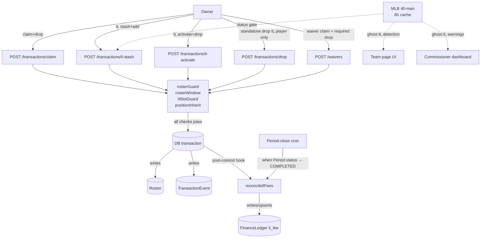
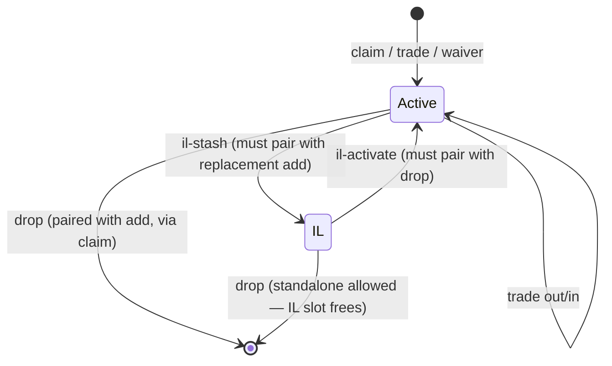

# Roster Rules Enforcement — Add/Drop Integrity, IL Slots, and Per-Period IL Fees

## Enhancement Summary

**Deepened on:** 2026-04-21
**Sections enhanced:** Architecture, Schema changes, MLB-status gate, IL fee service, Implementation phases, Risks, Acceptance criteria, System-wide impact
**Reviewers run (parallel):** `architecture-strategist`, `data-integrity-guardian`, `data-migration-expert`, `performance-oracle`, `security-sentinel`, `kieran-typescript-reviewer`, `code-simplicity-reviewer`, `pattern-recognition-specialist`, `deployment-verification-agent`, `julik-frontend-races-reviewer`
**Research run:** `best-practices-researcher` (fantasy platform comparison), `framework-docs-researcher` (Prisma 6, outbox, advisory-lock), `learnings-researcher` (7 applicable prior solutions), `Explore` (waiver processor ground truth)

### Top changes baked into the plan body below

1. **`ilFeeService` relocated** — moved from non-existent `features/finance/` to `features/transactions/services/` (unregistered module would be drift from CLAUDE.md's 27-module registry).
2. **FinanceLedger unique constraint fix** — the proposed `@@unique([type, teamId, periodId, playerId])` is structurally broken under Postgres NULL semantics. Replaced with a **partial unique index scoped to `il_fee`** via raw SQL in the migration.
3. **FinanceLedger becomes append-only** — replaced hard `delete` in reconciliation with `voidedAt` soft-delete + **reversal entries** (negative `il_fee` amount). Preserves audit trail and defends against "money disappeared" disputes.
4. **MLB status check moved OUTSIDE `$transaction`** — the plan originally put a 200–2000ms HTTPS roundtrip inside a row-locked block. Fixed.
5. **Ghost-IL "fail open" reversed** — fails CLOSED on write paths (stash rejection), fails OPEN only on read-side badges/detection. Closes the malicious-commissioner timing attack vector.
6. **`RosterSlotEvent` table promoted to Phase 1** — deferring it as "maybe later" makes fee correctness depend on brittle TransactionEvent pairing. Append-only event log is the right foundation for money.
7. **`effectiveDate` validator tightened** — Zod `datetime()` + `new Date()` parse + NaN rejection + season-window clamp. Previous regex allowed `9999-99-99` and trailing garbage.
8. **Reconciliation is now idempotent under concurrency** — `pg_advisory_xact_lock(hashtext('il_fee_reconcile'), periodId)` + Serializable isolation per period. Batched query shape (one `findMany` + `createMany({skipDuplicates:true})` + `deleteMany`) drops reconcile cost ~100× for backdates.
9. **Typed `RosterRuleError` with code union** — replaces string-match error propagation. Tests assert on `code`, not on brittle string fragments.
10. **`ENFORCE_ROSTER_RULES` env kill switch added** — the plan rejected feature flags in general, but a single env-var circuit breaker for the enforcement layer (default ON) is a cheap safety net for a live-league rollout. Billing stays live either way.

### New considerations discovered

- **Audit coverage gap**: commissioner god-mode needs its own `CommissionerAuditLog` with before/after roster snapshots, reason field, and IP hash. TransactionEvent alone is insufficient given the power being exercised.
- **Backfill policy for existing IL states**: production rosters already have `assignedPosition="IL"` rows with no `IL_STASH` event history. Reconciliation is **forward-only from ship date**; past stints are not retroactively billed. Documented as a one-time cutoff.
- **Conditional waiver claims** (`ONLY_IF_UNAVAILABLE`, `PAIR_WITH`) already exist and interact with required `dropPlayerId`. Plan now specifies the interaction: conditional claims still require `dropPlayerId` at submission, re-evaluation happens at processing.
- **Pre-check endpoint** for IL-stash modal (`GET /api/transactions/il-stash/precheck`): returns fresh slot availability + MLB status so modal opens on current state, not page-load-stale state.
- **`verifyRosterIntegrity()` post-transaction hook**: from the trade-reversal-ghost-roster learning — defensive check that asserts roster invariants held after every mutation.
- **UI state machine with `Symbol()` constants**: replaces naked `isPending` boolean across all new modals. Covers `IDLE → VALIDATING → SUBMITTING → REFETCHING → ERRORED` transitions.
- **Position-inherit is stricter than every mainstream fantasy platform** — Yahoo/ESPN/CBS/Fantrax all use free-slot assignment. OGBA's "added player takes dropped player's exact slot" is a deliberate divergence; UX must filter drop candidates by compatibility to prevent confusion.

### Unchanged but validated

- Extra-capacity IL model (universal across platforms)
- Owner-initiated activation (universal)
- MLB "Injured List" prefix as eligibility gate (matches Yahoo/CBS/ESPN)
- Bundled stash+add, bundled activate+drop atomics
- `SELECT FOR UPDATE` + interactive `$transaction` pattern
- Extending `assignedPosition="IL"` rather than adding slot columns to Team

Full review synthesis with source attribution is in the **Appendix: Deepen-Plan Review Synthesis** at the end of this doc.

---

## Overview

Enforce OGBA's foundational roster rules at the API layer so invalid states are impossible to reach: every add has a corresponding drop, added players take the dropped player's exact position slot (with eligibility check), IL slots are extra capacity gated by MLB status, and each IL-occupied slot incurs a per-period fee. Currently most of these rules exist only in commissioners' heads — the code accepts illegal roster states and ships them into standings and billing.

This is a single-PR delivery bundling enforcement + fee billing, per Q15 decision. Scope is large but the pieces are tightly coupled: billing depends on the enforcement being correct (you can't bill for an IL state that the system let someone create illegally).

## Problem Statement

The code today silently accepts roster states that violate the league's real-world rules. Specifically:

1. **Claim without drop is allowed** whenever a team is below the hardcoded cap of 23. Once season starts, OGBA expects roster to be at exactly 23 active — a team at 22/23 should not be able to claim a free player. (`server/src/lib/rosterGuard.ts:47-65`)
2. **Roster cap is hardcoded to 23** regardless of league. `DEFAULT_ROSTER_MAX = 23` in `rosterGuard.ts` ignores `roster.pitcher_count + roster.batter_count`. Works for OGBA by coincidence; breaks any other league config.
3. **Position-inherit is not enforced.** When a player is added, they get placed in the slot matching their primary position — not the dropped player's slot. A team can therefore end up with an invalid position-count distribution (e.g., 6 OF where the rules allow 5).
4. **"IL" exists as a position label only.** `POSITIONS` includes `"IL"` but nothing gates who can be in an IL slot, how many IL slots a team has, or the MLB-status requirement for eligibility. No stash-and-add atomic flow, no activate-and-drop atomic flow.
5. **Ghost-IL state is invisible.** If a team keeps a player in an IL slot whose MLB status has returned to Active, the system has no check and no surface for it.
6. **Waiver claims allow missing `dropPlayerId`.** Processor adds without drop if there's room → same rule violation as #1, but now asynchronous and harder to catch.
7. **IL fees are documented but not charged.** `DEFAULT_RULES` lists `il.il_slot_1_cost = $10` and `il.il_slot_2_cost = $15` but no code reads them, and `FinanceLedger` has no period-scoped entries for IL fees despite the `il_fee` type already being reserved in the model comment.

Rock-solid fix: enforce the invariants at the transaction boundary (API layer, inside the existing row-locked transactions), add the two new atomic endpoints (stash+add, activate+drop), write the IL fee cron, and surface state in the UI so owners and commissioners can reason about what's happening.

## Proposed Solution

Three-layer change:

1. **Backend enforcement** (new library modules + endpoint changes + schema tweaks)
2. **IL fee billing** (new service + period-close hook + backdate reconciliation)
3. **UI surfacing** (Team page IL subsection, ghost-IL warnings, waiver form gating)

Everything ships in one PR per Q15 decision. No feature flags — enforcement goes live atomically with the rule changes it enforces.

## Technical Approach

### Architecture



Roster state machine from a single player's perspective:



### Guard library layout

```
server/src/lib/
├── rosterGuard.ts          # extend: assertRosterAtExactCap(), reads from league rules
├── rosterWindow.ts         # already exists from backdate PR
├── ilSlotGuard.ts          # NEW — slot cap, ghost-IL detection, stint rank
└── rosterRuleError.ts      # NEW — typed error with code union for all guards

server/src/features/transactions/services/
└── ilFeeService.ts         # NEW — stint derivation, period reconciliation,
                            #       billing writes to FinanceLedger.
                            # Lives in transactions/ (not a new "finance" module)
                            # per CLAUDE.md's 27-module registry convention.
```

**Position-inherit is not its own module.** Per simplicity review, the eligibility check (`posList × positionToSlots(slot).includes(...)`) is ~8 lines. Inline it as a local helper in `transactions/routes.ts` (or in a small util file inside the transactions feature) rather than creating a top-level module with one function.

### `RosterSlotEvent` (Phase 1, not deferred)

Append-only event log for every IL slot transition. The ledger's correctness depends on this being authoritative — deriving stints from paired `TransactionEvent` rows was rejected (architecture review: "money correctness depends on this being right; easiest way for it to drift").

```prisma
model RosterSlotEvent {
  id        Int      @id @default(autoincrement())
  teamId    Int
  playerId  Int
  leagueId  Int
  event     String   // "IL_STASH", "IL_ACTIVATE", "IL_RELEASE" (drop from IL)
  effDate   DateTime // effective date (respects commissioner backdate)
  createdAt DateTime @default(now())
  createdBy Int?     // user id of actor
  reason    String?  // commissioner-provided justification, optional

  team   Team   @relation(fields: [teamId], references: [id])
  player Player @relation(fields: [playerId], references: [id])
  league League @relation(fields: [leagueId], references: [id])

  // Idempotency — same (teamId, playerId, effDate, event) can't be written twice
  @@unique([teamId, playerId, effDate, event])
  @@index([leagueId, effDate])
  @@index([teamId, playerId, effDate])
}
```

Stint derivation becomes a single indexed query instead of paired-event reconstruction: `SELECT * FROM RosterSlotEvent WHERE leagueId = ? AND effDate BETWEEN periodStart AND periodEnd ORDER BY teamId, playerId, effDate`.

### New endpoints

**`POST /api/transactions/il-stash`**

Atomic "place X on IL + add Y." Both succeed or neither does.

```typescript
// pseudo
body: {
  leagueId: number;
  teamId: number;
  stashPlayerId: number;     // player currently on this team's active roster
  addPlayerId?: number;       // or addMlbId for lazy-create lookup
  addMlbId?: number | string;
  effectiveDate?: string;     // admin-only backdate
}

// Order of operations — CRITICAL: MLB-status check + player lookups happen
// OUTSIDE the $transaction. Network I/O and long-running work must never
// execute inside a row-locked block (performance review).
//
// PRE-TRANSACTION (no locks held):
// P1. verify stashPlayer is on teamId's active roster (read-only)
// P2. verify stashPlayer.mlbStatus starts with "Injured List" via 6h-cached
//     40-man feed. FAILS CLOSED on cache miss + feed unavailable (security
//     review — avoids "stash non-IL player during feed outage" attack).
//     Record (status, cacheFetchedAt) to pass into the transaction for
//     evidence on the TransactionEvent row.
// P3. resolve addPlayer (playerId or via mlbId lookup)
// P4. inline position-eligibility check: addPlayer's posList must include
//     stashPlayer's current assignedPosition via positionToSlots()
//
// TRANSACTION (SELECT FOR UPDATE on Team row, isolation=ReadCommitted):
// T1. re-read stashPlayer's Roster row FOR UPDATE (guards against concurrent
//     mutations between P1 and T1)
// T2. count team IL slot occupancy < il.slot_count (league rule)
// T3. assert no ghost-IL players on this team (block gate)
// T4. assertNoOwnershipConflict for addPlayer at acquiredAt=effective
//     (excludeRosterIds if commissioner god-mode is releasing from another team)
// T5. god-mode: if addPlayer is on another team, release them at effective
//     with source="COMMISSIONER_REASSIGN" (carries through to audit)
// T6. UPDATE stashPlayer's Roster: assignedPosition="IL"
//     (keep acquiredAt/releasedAt — stash is not a drop)
// T7. CREATE addPlayer's Roster row: teamId, acquiredAt=effective,
//     assignedPosition=<stashPlayer's old slot>
// T8. CREATE RosterSlotEvent row (event="IL_STASH", effDate=effective,
//     createdBy=userId, reason optional). Idempotent via compound unique.
// T9. CREATE TransactionEvent rows: IL_STASH + ADD, effDate=effective,
//     deterministic rowHash = sha256(leagueId|teamId|playerId|event|effDate)
//     so retries of the HTTP request don't create duplicates
// T10. if effective is inside an OPEN period (not yet COMPLETED):
//      reconcile il_fee entries for that period INLINE in the transaction
//      (short-lived; same connection)
// T11. if effective crosses one or more CLOSED period boundaries:
//      insert OutboxEvent row with payload {leagueId, affectedPeriodIds[]}
//      for the post-commit reconciler worker
// T12. writeAuditLog via helper at transaction end (or post-commit, matches
//      existing codebase pattern in /transactions/claim)
```

**`POST /api/transactions/il-activate`**

Atomic "activate X from IL + drop Y." Owner-initiated (Q8 = A).

```typescript
// pseudo
body: {
  leagueId: number;
  teamId: number;
  activatePlayerId: number;  // player currently in this team's IL slot
  dropPlayerId: number;       // player to drop from active roster
  effectiveDate?: string;
}

// order of operations:
// 1. verify activatePlayer is on teamId's roster with assignedPosition="IL"
// 2. verify dropPlayer is on teamId's active roster (assignedPosition != "IL")
// 3. positionInherit: activatePlayer's posList × positionToSlots() must include dropPlayer's assignedPosition
// 4. No ghost-IL check required — this IS the ghost-IL resolution path
// 5. UPDATE dropPlayer's Roster: releasedAt=effective, source="DROP"
// 6. UPDATE activatePlayer's Roster: assignedPosition=dropPlayer's_old_slot
// 7. CREATE two TransactionEvent rows: IL_ACTIVATE, DROP, effDate=effective
// 8. post-commit: reconcileIlFees if effective crosses a period boundary
```

### Changes to existing endpoints

**`POST /api/transactions/claim`**

- `dropPlayerId` becomes **required** when `Season.status === 'IN_SEASON'`. Pre-season claims (SETUP/DRAFT) remain unchanged for initial roster loading.
- Apply position-inherit rule: incoming player takes dropPlayer's `assignedPosition`, must be eligible.
- Roster cap computed from league rules (`roster.pitcher_count + roster.batter_count`) not hardcoded 23.
- Ghost-IL gate: team with any ghost-IL players cannot claim. Clear error message instructs to resolve first.
- Keep existing commissioner god-mode backdate / cross-team reassign.

**`POST /api/transactions/drop`**

- When `Season.status === 'IN_SEASON'` AND the target player is on the active roster (not IL): standalone drop is **rejected**. Owner must use `/claim` with matching add.
- When target player is in IL slot: drop is allowed. This reduces IL count by 1 and is the path to release an IL-stashed player entirely.
- Apply effective-date + reconcileIlFees if dropping an IL player crosses period boundary.

**`POST /api/waivers`**

- `dropPlayerId` becomes a **required** field on `WaiverClaim` submission (Q9).
- At claim-submission time: warn if dropPlayer is not position-eligible for addPlayer's slot (advisory, doesn't block — state may change before processing).
- At claim-processing time: re-run positionInherit + rosterGuard checks. Fail the claim if incompatible.
- Waiver batch processor uses the same guards as `/claim`.

**`POST /api/trades/:id/process`** (already shipped in backdate PR)

- No changes required. Trades are zero-sum on count; incoming players go to their primary-position slot in recipient's active roster. Trade-received players whose MLB status is IL go to active roster regardless — owner can do a follow-up `/il-stash` if they want to park them.
- Noted for future: a trade moving an already-IL'd player from Team A's IL slot → Team B's roster should arrive on Team B as active (subject to Team B's roster cap). The existing code already does this.

### Schema changes

```prisma
// Change 1: Add period + player references to FinanceLedger plus audit columns.
// The append-only pattern (voidedAt + reversal rows) replaces hard DELETE for
// ledger correctness — data-integrity review flagged hard DELETE as an
// "irrecoverable financial data loss" risk once downstream systems read these rows.
model FinanceLedger {
  id        Int      @id @default(autoincrement())
  teamId    Int
  type      String
  amount    Int       // integer cents or whole-dollar depending on existing convention
  reason    String?
  ts        DateTime @default(now())

  // NEW — nullable for backward compat with existing entry_fee/bonus rows.
  // Required for rows where type == "il_fee" (enforced in app layer, since
  // Postgres NULLs don't enforce across null values anyway).
  periodId    Int?
  playerId    Int?
  voidedAt    DateTime?  // soft-delete marker — set when reconciliation
                         // determines the row should no longer apply
  reversalOf  Int?       // id of the ledger row this reverses (null if original)
  createdBy   Int?       // user id of actor (reconcile cron, commissioner action)

  team     Team    @relation(fields: [teamId], references: [id])
  period   Period? @relation(fields: [periodId], references: [id], onDelete: NoAction)
  player   Player? @relation(fields: [playerId], references: [id], onDelete: NoAction)
  reverses FinanceLedger? @relation("FinanceLedgerReversal", fields: [reversalOf], references: [id])
  reversedBy FinanceLedger[] @relation("FinanceLedgerReversal")

  @@index([teamId])
  @@index([periodId])
  @@index([playerId])
  @@index([teamId, periodId])       // for reconcile cleanup sweep
}
```

**Raw-SQL partial unique index** (Prisma can't express `WHERE` on `@@unique`) — add in the migration after the model diff applies:

```sql
-- Scoped uniqueness for IL fee rows ONLY.
-- Prevents the reconcile cron from double-charging while allowing entry_fee/
-- bonus/auction_adjust rows to retain their existing semantics (where
-- periodId/playerId are legitimately null and should NOT collide).
-- Requires voidedAt IS NULL so that reversal/void history can coexist.
CREATE UNIQUE INDEX finance_ledger_il_fee_active_uniq
  ON "FinanceLedger" ("teamId", "periodId", "playerId")
  WHERE type = 'il_fee' AND "voidedAt" IS NULL;
```

The original plan's `@@unique([type, teamId, periodId, playerId])` is broken under default Postgres NULL semantics (`NULLS DISTINCT` pre-PG15): rows with null `periodId`/`playerId` don't collide with each other, so the constraint does nothing for non-IL rows AND fails to protect against duplicate null-periodId IL fees. The partial unique above fixes both.

**Change 2: new league rule.** Added to `DEFAULT_RULES` (server/src/lib/sports/baseball.ts) AND backfilled into existing league rule rows in the same migration:

```sql
-- SQL migration step after model DDL
INSERT INTO "LeagueRule" ("leagueId", category, key, value, label, "isLocked", "createdAt", "updatedAt")
SELECT l.id, 'il', 'slot_count', '2', 'IL Slots per Team', false, NOW(), NOW()
FROM "League" l
WHERE NOT EXISTS (
  SELECT 1 FROM "LeagueRule" r
  WHERE r."leagueId" = l.id AND r.category = 'il' AND r.key = 'slot_count'
);
```

`isLocked=false` is deliberate — OGBA is mid-season with locked rules, but this is a new rule key, not a modification of an existing locked one.

**Change 3: `Period.status` String → enum.** Typo-prone `status === 'COMPLETED'` checks are load-bearing for the reconciliation cron. Convert to:

```prisma
enum PeriodStatus {
  PENDING
  ACTIVE
  COMPLETED
}

model Period {
  // ...
  status PeriodStatus @default(PENDING)
  // ...
}
```

Backfill existing values in the migration (`'pending' → PENDING`, etc.). Data-integrity review called this out — "typos in any code path silently skip reconciliation."

**Change 4: indexes on `TransactionEvent`** (performance review):

```prisma
model TransactionEvent {
  // existing fields unchanged
  @@index([leagueId, transactionType, effDate])   // stint scans + backdate period lookups
  @@index([teamId, playerId, effDate])             // event pairing within a player's history
}
```

And on `Period` for the backdate-affected-period overlap scan:

```prisma
@@index([leagueId, startDate, endDate])
```

**Change 5: `RosterSlotEvent`** — see schema in the Guard library layout section above.

No column additions to `Roster` — continue using `assignedPosition = "IL"` as the IL-slot marker. Stint history lives in the new `RosterSlotEvent` table.

```typescript
// Change 2: New league rule added to DEFAULT_RULES (server/src/lib/sports/baseball.ts)
{ category: "il", key: "slot_count", value: "2", label: "IL Slots per Team" },
```

No column additions to `Roster` — we continue using `assignedPosition = "IL"` as the IL-slot marker. The "rank" (1st vs 2nd) is computed from `acquiredAt` ordering among IL-slotted rows on the same team, with `id` as the tiebreaker for simultaneous entries.

### MLB status gate (Q5, Q6, Q13)

No schema change. **The check runs BEFORE the transaction opens** (performance: no HTTP I/O inside row-locked blocks; security: fail-closed on feed unavailability):

```typescript
// server/src/lib/ilSlotGuard.ts (pseudo)
export type MlbStatusCheck = {
  status: string;          // raw MLB status string, e.g. "Injured List 10-Day"
  cacheFetchedAt: Date;    // when the underlying 40-man fetch was done
};

// FAILS CLOSED on cache miss + feed unreachable. Original plan had it
// "fail open" — security review identified this as an exploitable attack
// vector (commissioner stashes non-IL player during feed outage).
export async function checkMlbIlEligibility(
  playerId: number,
): Promise<MlbStatusCheck> {
  const player = await prisma.player.findUnique({
    where: { id: playerId },
    select: { mlbId: true, mlbTeam: true, name: true },
  });
  if (!player?.mlbId || !player?.mlbTeam) {
    throw new RosterRuleError("MLB_IDENTITY_MISSING",
      `${player?.name ?? `Player #${playerId}`} has no MLB identity — cannot verify IL status.`);
  }

  const result = await getMlbPlayerStatus(player.mlbId, player.mlbTeam);
  // getMlbPlayerStatus throws if cache is empty AND live fetch fails —
  // it does NOT return a stale-but-possibly-wrong default. Fail-closed.

  if (!result.status?.startsWith("Injured List")) {
    throw new RosterRuleError("NOT_MLB_IL",
      `${player.name}'s MLB status is "${result.status}" — not eligible for an IL slot. Only "Injured List …" statuses qualify.`);
  }

  return { status: result.status, cacheFetchedAt: result.fetchedAt };
}
```

The returned `MlbStatusCheck` is threaded into the transaction and stored on the `RosterSlotEvent` row (and in `TransactionEvent.metadata`) as evidence of "what status the commissioner/owner saw at stash time." This defends against future disputes and the TOCTOU window between cache read and commit.

**Caching strategy:** Keep the existing 6h cache key on MLB team. Commissioner dashboard exposes a "refresh MLB status" button that force-invalidates the cache for one team — for the rare case where MLB flipped a status inside the cache window and an owner needs to act immediately. Every force-refresh writes an audit record (who, when, for which team) so we can detect abuse.

### Position-inherit logic (Q8 follow-on)

```typescript
// server/src/lib/positionInherit.ts (pseudo)
// imports positionToSlots from sportConfig
export function isEligibleForSlot(posList: string, targetSlot: string): boolean {
  const positions = posList.split(",").map(p => p.trim().toUpperCase());
  for (const pos of positions) {
    if (positionToSlots(pos).includes(targetSlot)) return true;
  }
  return false;
}

export function assertAddEligibleForDropSlot(add: { name: string; posList: string }, dropSlot: string) {
  if (!isEligibleForSlot(add.posList, dropSlot)) {
    throw new Error(`${add.name} is not eligible for the ${dropSlot} slot. Pick a different drop (one whose slot ${add.name} can fill).`);
  }
}
```

### IL fee service (Q14–Q19)

```typescript
// server/src/features/finance/ilFeeService.ts (pseudo)

// Q19 answer: rank is sticky per stint, stamped at entry.
// A "stint" = a continuous window where a player occupied an IL slot for a team.
// If a player leaves IL and later re-enters, that's a new stint with a new rank.

type IlStint = {
  teamId: number;
  playerId: number;
  startedAt: Date;              // when assignedPosition flipped to "IL"
  endedAt: Date | null;         // when it flipped away or they were released
  rankAtEntry: 1 | 2;            // computed from concurrent IL count at startedAt
};

// Compute stints from Roster history.
// For each Roster row where assignedPosition="IL", the stint runs from acquiredAt
// (or from a TransactionEvent IL_STASH, if we track stash explicitly — cleaner)
// to releasedAt OR the next IL_ACTIVATE event.
//
// NOTE: assignedPosition today is mutable on the same Roster row. For clean stint
// tracking we need a history. Options:
//   (a) Create a new Roster row on IL stash/activate (rather than mutating) —
//       preserves a clean chronological trail, but changes existing behavior.
//   (b) Add a RosterSlotEvent table that logs (rosterId, slot, at, event).
//   (c) Derive stints from TransactionEvent rows (IL_STASH/IL_ACTIVATE paired
//       with Roster.acquiredAt/releasedAt).
//
// Decision: (c) for MVP — TransactionEvent rows are the authoritative record
// of roster transitions. Query: for a given team+player, pair IL_STASH events
// with the next IL_ACTIVATE or DROP event, define a stint window.

async function computeStintsForPeriod(leagueId: number, periodId: number): Promise<IlStint[]>;

// For each stint, determine rank at entry (how many OTHER IL stints were open on
// the same team when this one started). Rank 1 = $10, rank 2 = $15.
async function feeForStint(stint: IlStint, rules: LeagueRules): Promise<number>;

// Main entry point — idempotent + concurrency-safe.
// Uses partial unique index + advisory lock + append-only semantics.
async function reconcileIlFeesForPeriod(
  leagueId: number,
  periodId: number,
  opts: { actorUserId?: number; dryRun?: boolean } = {},
): Promise<{ added: number; voided: number; unchanged: number }> {
  // Concurrency guard: advisory lock keyed on period id.
  // Two concurrent reconcile calls on the same period serialize; different
  // periods (and different leagues) run in parallel.
  return prisma.$transaction(async (tx) => {
    await tx.$queryRaw`
      SELECT pg_advisory_xact_lock(hashtext('il_fee_reconcile'), ${periodId})
    `;

    const period = await tx.period.findUnique({ where: { id: periodId } });
    if (!period || period.leagueId !== leagueId) {
      throw new Error(`Period ${periodId} not found in league ${leagueId} (IDOR guard)`);
    }

    const rules = await loadLeagueRules(tx, leagueId);

    // Single query: derive stints directly from RosterSlotEvent log (promoted
    // from deferred to Phase 1 per architecture review).
    const billable = await computeBillableStints(tx, leagueId, period);

    // Single query: existing active il_fee rows for this (league, period).
    const existing = await tx.financeLedger.findMany({
      where: {
        period: { leagueId },
        periodId,
        type: "il_fee",
        voidedAt: null,
      },
    });

    // Compute diff — what to add, what to void.
    const billableKey = (s: BillableStint) => `${s.teamId}:${s.playerId}`;
    const existingKey = (r: typeof existing[0]) => `${r.teamId}:${r.playerId}`;
    const billableMap = new Map(billable.map(s => [billableKey(s), s]));
    const existingMap = new Map(existing.map(r => [existingKey(r), r]));

    const toAdd: BillableStint[] = [];
    const toVoid: typeof existing = [];
    const unchanged: string[] = [];

    for (const [k, stint] of billableMap) {
      const existingRow = existingMap.get(k);
      const expectedAmount = stint.rankAtEntry === 1
        ? rules.il_slot_1_cost : rules.il_slot_2_cost;
      if (!existingRow) {
        toAdd.push(stint);
      } else if (existingRow.amount !== expectedAmount) {
        // Rank changed after backdate — void the old row, add a reversal,
        // then add the correct row. Never mutate in place (append-only).
        toVoid.push(existingRow);
        toAdd.push(stint);
      } else {
        unchanged.push(k);
      }
    }
    // Stints present before but gone now — void them.
    for (const [k, row] of existingMap) {
      if (!billableMap.has(k)) toVoid.push(row);
    }

    if (opts.dryRun) {
      return { added: toAdd.length, voided: toVoid.length, unchanged: unchanged.length };
    }

    // Batched writes — performance review flagged per-row upsert as O(teams²).
    // createMany skips rows that would collide with the partial unique index.
    if (toAdd.length > 0) {
      await tx.financeLedger.createMany({
        data: toAdd.map(s => ({
          teamId: s.teamId,
          periodId,
          playerId: s.playerId,
          type: "il_fee",
          amount: s.rankAtEntry === 1 ? rules.il_slot_1_cost : rules.il_slot_2_cost,
          reason: `IL rank ${s.rankAtEntry} — period ${period.name}`,
          createdBy: opts.actorUserId ?? null,
        })),
        skipDuplicates: true,
      });
    }
    // Append-only voids + reversal entries. No DELETE from FinanceLedger ever.
    for (const row of toVoid) {
      await tx.financeLedger.update({
        where: { id: row.id },
        data: { voidedAt: new Date() },
      });
      await tx.financeLedger.create({
        data: {
          teamId: row.teamId,
          periodId: row.periodId,
          playerId: row.playerId,
          type: "il_fee",
          amount: -row.amount,   // negative reversal
          reason: `Reversal of ledger row ${row.id} (backdate reconciliation)`,
          reversalOf: row.id,
          createdBy: opts.actorUserId ?? null,
        },
      });
    }

    // Log the reconciliation as an audit event with summary counts.
    // Silent-null-LLM learning: log the billable stint count so monitoring
    // catches "zero stints" as a signal (query failure vs. truly no IL activity).
    writeAuditLog({
      userId: opts.actorUserId ?? null,
      action: "IL_FEE_RECONCILE",
      resourceType: "Period",
      resourceId: String(periodId),
      metadata: {
        leagueId, periodId,
        stintCount: billable.length,
        added: toAdd.length,
        voided: toVoid.length,
        unchanged: unchanged.length,
      },
    });

    return { added: toAdd.length, voided: toVoid.length, unchanged: unchanged.length };
  }, { isolationLevel: "Serializable", timeout: 30_000 });
}
```

**Batched multi-period variant** for backdate reconciliation:

```typescript
async function reconcileIlFeesForPeriods(
  leagueId: number,
  periodIds: number[],
  opts: { actorUserId?: number } = {},
): Promise<void> {
  // Sequential per period (each takes an advisory lock on its periodId,
  // so different periods don't serialize with each other globally but the
  // same period is always single-threaded). For backdates spanning 12
  // periods this is ~12 short transactions totaling <1s.
  for (const pid of periodIds) {
    await reconcileIlFeesForPeriod(leagueId, pid, opts);
  }
}
```

// Triggers:
// - Period transition to COMPLETED: reconcile all periods that just completed.
// - After any IL-related transaction with effectiveDate crossing period boundaries:
//   determine affected period range and reconcile each.
```

### Cron / event hooks

**Period-close trigger.** Period status is flipped by the commissioner via `/commissioner/:leagueId/periods` (or a future auto-close cron). Hook into that transition: when `status` changes to `COMPLETED`, invoke `reconcileIlFeesForPeriod(leagueId, periodId)`. Wrap the cron run in `withAdvisoryLock("il_fee_cron", leagueId)` for forward-compatibility with multi-container deploys.

**Backdate reconciliation hook — split by period status:**

- **Same-period backdate** (effectiveDate falls inside the current OPEN period): reconciliation runs INSIDE the originating transaction (T10 in the order-of-operations above). Cheap (one period, one team), low contention, and gives immediate consistency. No post-commit step.
- **Cross-period-boundary backdate** (effectiveDate falls inside a CLOSED period, or crosses >1 period boundary): reconciliation runs POST-COMMIT via the **outbox pattern**. Write an `OutboxEvent` row inside the originating transaction (step T11 above); a drainer (initially: a small setInterval in-process, later: `pg-boss`) picks it up and calls `reconcileIlFeesForPeriods(leagueId, affectedPeriodIds)` under its own advisory lock.

```typescript
// Affected period computation — runs inside the originating transaction
async function findAffectedPeriods(
  tx: Prisma.TransactionClient,
  leagueId: number,
  stintStart: Date,
  stintEnd: Date | null,
): Promise<{ id: number; status: PeriodStatus }[]> {
  return tx.period.findMany({
    where: {
      leagueId,
      // Period overlaps stint window [stintStart, stintEnd ?? +∞)
      startDate: { lte: stintEnd ?? new Date("9999-12-31") },
      endDate:   { gte: stintStart },
    },
    select: { id: true, status: true },
  });
}
```

**Outbox model:**

```prisma
model OutboxEvent {
  id         Int       @id @default(autoincrement())
  kind       String    // "IL_FEE_RECONCILE"
  payload    Json      // { leagueId, periodIds: [...] }
  attempts   Int       @default(0)
  lastError  String?
  completedAt DateTime?
  createdAt  DateTime  @default(now())

  @@index([completedAt, createdAt])
}
```

Drain loop: `SELECT ... FOR UPDATE SKIP LOCKED LIMIT 10` every 5 seconds, process, mark `completedAt`. Advisory-lock the reconciliation itself (keyed by `leagueId + periodId`) so two drainers don't double-process the same period.

**Why outbox?** Without it, a crash between transaction commit and reconcile call leaves the ledger stale until next period-close. The outbox makes the post-commit side-effect durable.

### Implementation Phases

Phases reduced 5 → 4 (simplicity review — browser-verify was its own phase; merged into Phase 4 as "done means verified").

#### Phase 1: Foundation (schema + lib modules)

- Migration file `prisma/migrations/20260421000000_add_roster_rules_foundation/migration.sql` with header comment referencing this plan. Contents:
  - `ALTER TABLE "FinanceLedger" ADD COLUMN periodId INTEGER, playerId INTEGER, voidedAt TIMESTAMP, reversalOf INTEGER, createdBy INTEGER`
  - `CREATE UNIQUE INDEX finance_ledger_il_fee_active_uniq ON "FinanceLedger" (teamId, periodId, playerId) WHERE type = 'il_fee' AND voidedAt IS NULL` (partial unique — Prisma-can't-express)
  - FK constraints for period/player/reversalOf (ON DELETE NO ACTION per data-migration review)
  - `CREATE TABLE "RosterSlotEvent"` + unique + indexes
  - `CREATE TABLE "OutboxEvent"` + indexes
  - `CREATE TYPE "PeriodStatus" AS ENUM (...)` + `ALTER TABLE "Period" ALTER COLUMN status TYPE ...` with USING clause
  - `CREATE INDEX "TransactionEvent_leagueId_type_effDate_idx"` and other perf indexes
  - Backfill `il.slot_count = 2` into every `LeagueRule` row (idempotent per unique `(leagueId, category, key)`)
- `server/src/lib/rosterRuleError.ts` — typed `RosterRuleError extends Error` with discriminated `code` union: `"GHOST_IL" | "IL_SLOT_FULL" | "NOT_MLB_IL" | "POSITION_INELIGIBLE" | "ROSTER_CAP" | "DROP_REQUIRED" | "MLB_IDENTITY_MISSING" | "MLB_FEED_UNAVAILABLE" | "SEASON_NOT_IN_PROGRESS" | "IL_UNKNOWN_PLAYER"`. Express error middleware maps `code` → HTTP 400 with stable message.
- `server/src/lib/ilSlotGuard.ts` — MLB status check (pre-transaction, fail-closed), slot cap check, ghost-IL detection helpers. Each returns `MlbStatusCheck | void` or throws `RosterRuleError`.
- Extend `server/src/lib/rosterGuard.ts` — new `assertRosterAtExactCap(tx, teamId, leagueCap, options)` reads from league rules. Existing hardcoded `DEFAULT_ROSTER_MAX = 23` fallback is removed.
- Position-eligibility helper — a small function inline in `transactions/routes.ts` OR a single file `server/src/features/transactions/lib/positionInherit.ts`. Not a top-level `src/lib/` module (simplicity review).
- Audit script `server/src/scripts/auditRosterRules.ts` — read-only report of current violations (under-cap teams, ghost-IL, position-count drift, orphaned IL fees pre-ship) so commissioner resolves before enforcement kicks in. See R2.
- Unit tests for each guard in `server/src/lib/__tests__/`.
- **Deliverables:** 1 migration, 3 new lib files, 1 extended lib, 1 audit script, ~5 unit test files

#### Phase 2: Endpoint changes + new endpoints

- `POST /api/transactions/il-stash` — new endpoint
- `POST /api/transactions/il-activate` — new endpoint
- `POST /api/transactions/claim` — require `dropPlayerId` in-season, apply position-inherit, ghost-IL block
- `POST /api/transactions/drop` — reject active-player drops in-season; allow IL drops
- `POST /api/waivers` + waiver batch processor — require `dropPlayerId`, re-check at processing
- Integration tests (mocked DB) for each endpoint, happy + rejection paths
- **Deliverables:** 2 new route handlers, 3 updated handlers, ~12 integration tests

#### Phase 3: IL fee service + reconciliation

- `server/src/features/transactions/services/ilFeeService.ts` (relocated from non-existent `features/finance/` per pattern-recognition review) — `computeBillableStints`, `reconcileIlFeesForPeriod`, `reconcileIlFeesForPeriods`. Uses batched queries, advisory lock, Serializable isolation.
- `server/src/lib/outboxDrainer.ts` — in-process drainer for `OutboxEvent`. Polls every 5s, processes `IL_FEE_RECONCILE` events with per-(leagueId, periodId) advisory lock. Ready-to-swap-for-pg-boss interface.
- Hook into period-close: commissioner period-status endpoint writes an `OutboxEvent` when status → `COMPLETED` (not a direct reconcile call — durable under crash).
- Hook into IL-touching endpoints: inline reconciliation for same-period backdates, outbox enqueue for cross-period.
- Unit tests: stint computation edge cases (gap re-entries, simultaneous entry tiebreaker, period-boundary overlap, rank-at-entry stamping, void+reversal correctness).
- Integration tests: backdate across period boundary → reconciliation voids old + adds new; two concurrent reconciles on the same period serialize; reconcile is idempotent on re-run.
- Commissioner recovery endpoint: `POST /api/commissioner/:leagueId/reconcile-il-fees/:periodId` — gated by `requireCommissionerOrAdmin(leagueId)`, rate-limited to 1 call per period per 30s, validates `periodId` belongs to `leagueId` (IDOR guard). Supports `?dryRun=true` for commissioner inspection.
- **Deliverables:** 1 service file, 1 outbox drainer, 2 endpoint hooks, 1 manual-recovery endpoint, ~12 tests

#### Phase 4: UI + browser verify

- Team page (`client/src/features/teams/pages/Team.tsx`):
  - "IL" subsection below active roster showing IL-slotted players
  - Red "Ghost IL" badge on rows where `mlbStatus` is no longer `"Injured List …"`
  - "Place on IL" action on active-roster rows where `mlbStatus.startsWith("Injured List")` — opens stash+add modal
  - "Activate" action on IL rows — opens activate+drop modal
- Commissioner dashboard (Teams tab) ghost-IL banner: "N teams have ghost-IL players. [Details]"
- Waiver claim form — required dropdown for drop player, position-eligibility pre-warning
- Playwright E2E: owner IL stash flow, commissioner ghost-IL banner visible
- **Deliverables:** ~4 component updates, 2 new modals, 1 banner component, ~3 E2E tests

**Estimated total effort:** 4–6 focused days. Backend + billing is the bulk; UI and browser-verify consume maybe 1.5 days.

Phase 4 now includes browser-verify as "done" criteria rather than its own phase:
- Full end-to-end smoke via the admin UI: stash + add, activate + drop, backdate across periods, commissioner view of ghost-IL.
- Document behavior in `docs/RULES_AUDIT.md` (extend existing rules audit).
- Update `FEEDBACK.md` Session entry.
- Update `client/src/pages/Changelog.tsx` v0.64.0 entry.

## Alternative Approaches Considered

### Separate PR for billing (rejected per Q15)

Ship enforcement first, follow-up PR for fees. Pros: faster enforcement ship, lower blast radius per PR. Rejected because user explicitly requested bundle. Also: once enforcement is strict, teams start making real IL transitions that silently should've incurred fees. A gap between "rules enforced" and "fees charged" means backfilling billing history over a production window where commissioner god-mode corrections are already happening.

### Add IL slots as Roster columns instead of assignedPosition="IL" (rejected)

Alternative: add `ilSlot1PlayerId`, `ilSlot2PlayerId` to the `Team` model. Pros: explicit slot numbering solves Q16 (rank) without computation. Cons: doesn't generalize to future `il.slot_count > 2`, duplicates the Roster relation, breaks the "Roster row is the one truth for player ownership" pattern. Keeping it in `assignedPosition` matches the rest of the codebase.

### Auto-activate IL players when MLB reactivates them (rejected per Q8 = A)

Owner-initiated activation only. Cron could sync MLB status and auto-move players, but that creates a "who dropped Smith?" mystery when the activation triggers a forced drop. Cleaner to surface the ghost-IL state and let owners resolve.

### Full Roster history table (considered, deferred)

An audit table of every `Roster` slot change would make stint computation from a clean data source instead of from paired `TransactionEvent` rows. Phase 1 uses `TransactionEvent` as the authoritative history. If stint computation becomes error-prone in practice, add a `RosterSlotEvent` table in a follow-up.

## System-Wide Impact

### Interaction graph

- `POST /transactions/claim` → `$transaction` → `assertRosterAtExactCap` → `positionInherit.assertAddEligibleForDropSlot` → `ilSlotGuard.assertNoGhostIl` → `rosterWindow.assertNoOwnershipConflict` → Roster mutations → TransactionEvent writes → **post-commit** `reconcileIlFees` if period-crossing → optional AI analysis (unchanged).

- `POST /transactions/il-stash` → same transaction shape, plus `ilSlotGuard.assertMlbIlEligible` and `ilSlotGuard.assertIlSlotAvailable`.

- Standings computation (`standingsService.computeWithDailyStats`) already walks `acquiredAt`/`releasedAt` windows — no change needed. The inclusive-endpoint latent bug from the backdate PR's discussion remains a pre-existing issue; not in scope here but flagged as R6.

- Waiver batch processor (`server/src/features/waivers/routes.ts`) → existing row-lock pattern → add the same guards used by `/claim` → TransactionEvent writes (currently missing on waiver processor? verify) → post-commit `reconcileIlFees` if processing an IL-related claim.

- Commissioner period transition (`/commissioner/:leagueId/periods/:id`) → status updated to COMPLETED → **post-commit** `reconcileIlFeesForPeriod` for that period.

- `/commissioner/:leagueId/roster/assign` + `/release` → already updated in backdate PR for effectiveDate → add the same guards as `/claim` so commissioner can't bypass position-inherit.

### Error propagation

- User-level errors (guard failures) return `400` with specific messages: "X is already on Team Y's roster", "Roster limit exceeded", "Y is not eligible for the SS slot", "Your team has 2 IL slots in use", "Z is no longer on MLB IL — activate before stashing".
- Reconciliation errors are logged but **do not fail the original transaction.** If the main claim/stash commits and then `reconcileIlFees` fails, the claim is not reverted — instead the reconciliation can be re-run via the manual commissioner endpoint. This aligns with the existing "fire-and-forget post-commit" pattern used for trade AI analysis.
- Ghost-IL detection errors (MLB feed unavailable): fail open — don't block legitimate moves because the feed is temporarily down. Log a warning. Admin dashboard shows "MLB feed unavailable" if the 6h cache is stale beyond a threshold.

### State lifecycle risks

- **IL stash partial failure**: stashing X succeeds, adding Y fails. If this happened outside a transaction, the team would have an empty IL slot with no replacement. **Mitigation**: both operations are inside `prisma.$transaction`, so partial failure rolls back cleanly.
- **Concurrent IL stashes from two admin sessions**: team at 1/2 IL slots, two simultaneous stashes both pass the pre-check. **Mitigation**: `SELECT FOR UPDATE` on `Team` row inside the transaction (matches existing pattern in `/claim`).
- **Backdate creates ghost-IL retroactively**: commissioner backdates an IL_ACTIVATE to before a period boundary. The MLB status at that historical moment isn't stored (we only have current status via the 6h feed). **Mitigation**: MLB-status check applies to current state only, not historical. Commissioner backdating a stash means they're asserting "this player was MLB-IL'd on that date." We trust the commissioner (god-mode). Reconciliation adjusts fees accordingly.
- **Period-close reconciliation failure mid-run**: cron processes 10 teams, fails on team 7. Teams 1–6 have correct ledger; 7–10 still have stale entries. **Mitigation**: function is idempotent (upsert + delete-obsolete). Re-running it completes the work.
- **Data migration on existing prod rosters**: current production may have teams with illegal states (under-cap, wrong position counts). Phase 1 migration includes an audit script that reports violations but does NOT auto-fix them. Commissioner runs manual cleanups before enforcement goes live (see R2).

### API surface parity

- **Non-IL endpoints that touch rosters**: `/commissioner/roster/assign`, `/commissioner/roster/release`, `/commissioner/roster/:id` (PATCH for price/position edits), `/trades/:id/process`, `/trades/:id/reverse`, waiver batch processor. All must enforce the same guards where applicable:
  - `assign`/`release`: already touch roster count; apply `assertRosterAtExactCap` and `positionInherit` (in-season).
  - `PATCH /roster/:id`: only changes price/position/source. Position changes now must respect slot legality (player's `posList` × `positionToSlots()` must include new `assignedPosition`). Add a guard.
  - Trades: zero-sum on count; no position-inherit (multi-player trades don't have 1:1 pairing). Already correct.

### Integration test scenarios

1. **In-season claim without `dropPlayerId` → 400.** Validates the required-drop rule.
2. **Claim with position-incompatible drop → 400.** Dropping an SS, adding an OF-only player — eligibility check kicks in.
3. **IL stash succeeds, player moves from active slot to IL, replacement takes old slot.** Verifies atomic behavior and slot inheritance.
4. **IL stash rejected when player is MLB-active.** Verifies MLB status gate.
5. **IL stash rejected when team has 2 IL slots full.** Verifies cap.
6. **IL stash rejected when team has a ghost-IL player.** Verifies ghost-IL block.
7. **Ghost-IL: MLB activates a stashed player; `/transactions/il-stash` now fails with ghost-IL message; owner activates + drops; block clears; new stash succeeds.**
8. **Backdated stash crossing period boundary creates `il_fee` ledger entry for affected period.** Verifies reconciliation hook.
9. **Backdated activation that wipes a prior-period stint deletes the obsolete `il_fee` row.** Verifies cleanup side of reconciliation.
10. **Two concurrent stash attempts on the last remaining IL slot: one succeeds, the other fails with slot-full error.** Verifies row-lock works.
11. **Period transition to COMPLETED triggers fee computation for all teams.** Verifies cron hook.
12. **Manual commissioner `reconcile-il-fees/:periodId` recovers from a missed cron run.** Verifies admin recovery tool.
13. **Partial-unique-index prevents duplicate active `il_fee` rows but allows voided + active for same (teamId, periodId, playerId).** Verifies the append-only + reversal pattern coexists.
14. **Two concurrent `reconcileIlFeesForPeriod` calls on same period serialize via advisory lock.** Neither sees the other's partial state.
15. **Commissioner reconcile endpoint rejects IDOR attempt** (commissioner of league A tries to reconcile a period owned by league B → 404).
16. **MLB feed unavailable → `/il-stash` fails closed with `MLB_FEED_UNAVAILABLE` code.** Verifies the security fix for the fail-open attack vector.
17. **`effectiveDate = "9999-99-99"` and other malformed dates rejected by Zod.** Verifies tightened validator.
18. **Outbox drainer picks up an IL_FEE_RECONCILE event, processes it, marks completedAt; failed drainer run increments attempts and is retried.** Verifies durability.

## Acceptance Criteria

### Functional

- [ ] `/transactions/claim` requires `dropPlayerId` when `Season.status === "IN_SEASON"`
- [ ] `/transactions/claim` enforces position-inherit (added player eligible for dropped player's slot)
- [ ] `/transactions/drop` rejects active-roster drops when `Season.status === "IN_SEASON"` (IL drops still allowed)
- [ ] `POST /transactions/il-stash` endpoint exists and operates atomically per spec
- [ ] `POST /transactions/il-activate` endpoint exists and operates atomically per spec
- [ ] MLB-IL eligibility strictly checks `"Injured List"` prefix (10/15/60/7-day, all `"Injured List …"` statuses)
- [ ] IL slot count honored per league via `il.slot_count` rule
- [ ] Ghost-IL blocks further stashes; clear error message
- [ ] Roster cap computed from `roster.pitcher_count + roster.batter_count`
- [ ] Waiver claim requires `dropPlayerId` at submission; re-checks eligibility at processing
- [ ] Commissioner cross-team reassign still works (does not bypass these rules — position-inherit, roster cap, MLB-status still apply)
- [ ] `FinanceLedger` gets `il_fee` entries written by period-close cron
- [ ] Rank-at-entry stamping ($10 for rank 1, $15 for rank 2) per Q19 (a)
- [ ] Presence-based billing (Q17 = b) — any stint overlapping the period → full fee
- [ ] Backdated IL-related transactions trigger retroactive ledger reconciliation
- [ ] Commissioner manual recompute endpoint exists for recovery

### UI

- [ ] Team page shows IL subsection with any IL-slotted players and their MLB statuses
- [ ] Ghost-IL rows display a clear red badge with explanatory text
- [ ] "Place on IL" action appears on active rows when the player has an `"Injured List …"` status
- [ ] "Activate" action appears on IL rows
- [ ] Commissioner dashboard (Teams tab) shows a league-wide ghost-IL warning when any team has one
- [ ] Waiver claim form requires a drop-player dropdown selection

### Non-functional

- [ ] All existing tests continue to pass (currently 583 server, 201 client)
- [ ] New unit tests cover each guard in isolation
- [ ] New integration tests cover the 12 scenarios listed above
- [ ] Playwright E2E covers the owner IL stash + commissioner ghost-IL warning paths
- [ ] Backdate reconciliation completes within 2 seconds for a season's worth of periods per league
- [ ] Row-lock pattern maintained on concurrent transactions

### Quality gates

- [ ] `cd client && npx tsc --noEmit` clean
- [ ] `cd server && npx tsc --noEmit` clean
- [ ] Full `npm run test` suite green
- [ ] Browser-verified on dev server against the seeded OGBA 2026 league
- [ ] `FEEDBACK.md`, `Changelog.tsx`, `Roadmap.tsx`, `Tech.tsx` updated as needed
- [ ] Audit script run against production-like data before merge; report of any grandfathered violations surfaced to commissioner

## Success Metrics

- Zero illegal roster states reachable via API (verified by integration tests + audit script)
- IL fee ledger matches hand-computed totals for a known 2-period window in a test league
- No owner-reported claims of "my trade went through but my roster is wrong" in the 2 weeks post-ship
- Ghost-IL alerts catch real instances (expected: 2–5 per week per league during high-IL periods)

## Dependencies & Prerequisites

- **Backdate feature (PR #109, already merged)** — this plan builds on `rosterWindow.ts` and the effective-date plumbing.
- **MLB 40-man feed cache** (`fetchMlbTeamsMap`, `mlbGetJson`) must remain functional during transactions. 6h cache is acceptable; if it's down, the stash endpoint fails open with a warning (rate-limit future work).
- **Season + Period status endpoints** must reliably transition status so the period-close hook fires.
- **Admin/commissioner access** already established via existing middleware.

## Risk Analysis & Mitigation

### R1 — Scope creep during implementation
**Risk:** Too many moving parts; slip. **Mitigation:** This plan is the scope. Anything discovered mid-implementation that isn't in the acceptance criteria goes to a follow-up issue. Flag deviations in PR description.

### R2 — Existing roster states violate new invariants
**Risk:** Production has rosters that today's code created but new code would reject. Enforcing immediately breaks commissioner workflow. **Mitigation:** Pre-migration audit script reports violations. Commissioner resolves manually before enforcement goes live. Add a one-time `--lenient-first-run` flag if rollout needs a grace period.

### R3 — Backdate reconciliation complexity / bugs
**Risk:** The ledger-diff logic is the most error-prone piece. Wrong reconciliation → wrong money. **Mitigation:** Heaviest test coverage on this module (at least 5 scenarios). Manual `/commissioner/:leagueId/reconcile-il-fees/:periodId` endpoint as a recovery tool. Run the reconciliation in dry-run mode during code review and diff against hand-computed expectations.

### R4 — MLB feed latency / downtime
**Risk:** 6-hour cache means an injured player might still show Active for a few hours. Real-world IL stashes get rejected. **Mitigation:** Expose a commissioner-only "refresh MLB status" button that force-invalidates the cache for a specific team. Document in the error message: "MLB feed may be stale; commissioner can refresh."

### R5 — Position-inherit feels too strict
**Risk:** Owners hit frequent rejections when their obvious-to-them swap doesn't satisfy the position-inherit rule. **Mitigation:** UX work: when owner picks a drop, only show position-compatible candidates for the add (or vice versa). The backend enforces correctness; the frontend steers users toward valid choices.

### R6 — Pre-existing standings boundary double-count
**Risk:** Noted in backdate PR discussion: `standingsService.computeWithDailyStats` uses inclusive-both-ends day comparison, which technically double-counts a boundary day. Not triggered in practice but exists. **Mitigation:** Out of scope here. File a follow-up bug.

### R7 — Period `status` transition not hooked everywhere it needs to be
**Risk:** Commissioner updates period status via multiple paths (routes, admin panel, direct DB edit). If one path doesn't call `reconcileIlFeesForPeriod`, fees are missed. **Mitigation:** Hook in the Prisma-level middleware OR guarantee all paths route through a single service. Document it in `docs/DEV_NOTES.md`.

### R8 — Concurrency on simultaneous IL stashes
**Risk:** Two admin sessions both try to stash on the 2nd IL slot; both pre-checks pass, both try to commit. **Mitigation:** `SELECT FOR UPDATE` on Team row inside transaction (already the pattern elsewhere). Second caller sees the first's commit and gets slot-full error.

### R9 — Malicious commissioner during MLB feed outage
**Risk (from security review):** Original plan had "fail open" MLB status check when feed is unavailable. A commissioner could time a stash to exploit the cache staleness window and park a non-IL player in an IL slot. **Mitigation:** Fail CLOSED on `/il-stash` write path (new `MLB_FEED_UNAVAILABLE` error code). Commissioners can force-refresh the cache for one team, which writes an audit record. UI-side ghost-IL detection can fail open since it's read-only.

### R10 — FinanceLedger data loss from hard DELETE
**Risk (from data-integrity review):** Original plan's reconciliation did `prisma.financeLedger.delete` when a backdate invalidated a prior fee. Once any downstream (Venmo dashboards, season-end settlement emails, commissioner reports) consumes these rows, hard-deleting is irrecoverable financial data loss. **Mitigation:** Append-only pattern — set `voidedAt` on the original row, insert a **negative reversal entry** with `reversalOf = original.id`. Full audit trail preserved. Never `DELETE` from `FinanceLedger` from any code path.

### R11 — Broken unique constraint giving false idempotency
**Risk (data-integrity):** Original plan's `@@unique([type, teamId, periodId, playerId])` relied on Postgres NULL-distinct semantics for non-IL rows, which gives a false sense of safety. It also doesn't actually prevent duplicate-null-playerId IL fees. **Mitigation:** Replace with a partial unique index scoped to `type = 'il_fee' AND voidedAt IS NULL AND periodId IS NOT NULL AND playerId IS NOT NULL`, expressed as raw SQL since Prisma can't generate `WHERE` on `@@unique`.

### R12 — Commissioner audit gap
**Risk (security + pattern-recognition):** Commissioner god-mode (cross-team reassign, backdating, IL overrides) modifies other teams' history but only writes a normal `TransactionEvent` row. No before/after snapshot, no justification field, no actor IP. **Mitigation:** Extend `writeAuditLog` calls on commissioner endpoints with richer metadata: `{ before, after, reason, userIpHash, backdatedBy, reassignedFromTeamId }`. Consider a dedicated `CommissionerAuditLog` model if usage analysis shows TransactionEvent is too noisy for commissioner review.

### R13 — Rank-shift bugs during backdate reconciliation
**Risk (data-integrity):** A backdate that changes the entry order of two stints within a period changes one stint's rank from 2 → 1 (fee drops $15 → $10) and another's from 1 → 2 (fee rises $10 → $15). The append-only reconciler must write two void+reversal pairs plus two new rows. Easy to off-by-one. **Mitigation:** Heavy unit-test coverage of the rank-flip case (integration scenario 13); commissioner `?dryRun=true` mode on the recovery endpoint to inspect diffs before applying.

### R14 — Brittle error-propagation via string matching
**Risk (Kieran TS review + pattern-recognition):** Current codebase pattern is `try/catch` + `err.message.includes("Roster limit")` to map to HTTP 400. Copy-editing a guard's error message breaks every caller silently. **Mitigation:** Typed `RosterRuleError` with discriminated `code` union. Express error middleware maps `code` → 400 with stable message. Tests assert on `code`, not string fragments.

### R15 — Retroactive billing for pre-ship IL stints (policy: FULL retroactive, confirmed 2026-04-21)
**Risk (data-migration):** Production has rosters today with `assignedPosition = 'IL'` but no corresponding `IL_STASH` events (the table didn't exist). **Policy (user-confirmed):** full retroactive billing from each row's `Roster.acquiredAt`. Migration synthesizes one `RosterSlotEvent(event="IL_STASH", effDate=Roster.acquiredAt)` per existing IL-slotted row so reconciliation picks up every completed period the player has been stashed through.

**Consequence:** Teams with long-standing IL stashes (e.g., a player stashed April 1, ship April 21) receive back-billed `il_fee` entries for every completed period during that stretch. OGBA's periods are weekly-ish; a 3-period stash = ~$30, a full-month stash = $40–60. **Commissioner must notify owners before enforcement flips.**

**Mitigation:**
- `auditRosterRules.ts` (Phase 1 deliverable) outputs a **per-team dollar impact report** listing exactly which players, which periods, and what amount each team will owe at enforcement flip. Commissioner reviews and communicates to owners before turning on enforcement.
- `ENFORCE_ROSTER_RULES=false` env flag (R16) disables the new guards but billing can still run separately via commissioner manual reconcile — giving the commissioner a window to review the ledger impact before flipping enforcement to true.
- Dry-run mode on `reconcileIlFeesForPeriod` (`?dryRun=true`) lets the commissioner preview the ledger diff before committing.

### R16 — `ENFORCE_ROSTER_RULES` kill switch
**Risk (data-migration):** Plan rejected feature flags, but strict no-flag rollout for live-league enforcement is risky. A false-positive rejection wave would block legitimate commissioner workflow until a hotfix deploys. **Mitigation:** Single env-var circuit breaker `ENFORCE_ROSTER_RULES` (default `true`). Flip to `false` in Railway dashboard to disable just the enforcement checks while keeping the new endpoints and billing live. Documented in `docs/RAILWAY-DEPLOY.md`.

## Resource Requirements

- **1 engineer, 4–6 focused days.** Backend + billing is bulk; UI and browser-verify ~1.5 days.
- **No infrastructure changes.** No new services, no schema overhaul beyond the `FinanceLedger` columns.
- **Migration window**: the `FinanceLedger` migration is additive (new nullable columns + index), safe during live use.

## Future Considerations

- **Minor-league slots (user mentioned).** Design the IL-slot code as "extra-capacity slot class" so a future `minors.slot_count` rule can reuse the same machinery with a different gate condition (`mlbStatus === "Minor League"` or `"Optioned"`) and a different fee structure (or free).
- **Prorated IL fees.** Current spec is presence-based (flat per period). If the league decides prorated is fairer, swap `feeForStint` logic to days-on-IL / period-days × slot-cost.
- **Automatic IL recognition with owner confirm.** Instead of purely owner-initiated stash, detect when a rostered player flips to MLB IL and surface a "Stash [player]?" nudge with pre-filled replacement suggestions.
- **IL-fee settlement UI.** A "Fees" tab on the Team page showing accumulated `il_fee` entries for the season.
- **Commissioner rules editor for `il.slot_count`.** Currently added as a default; exposing it in the RulesEditor UI is a small Phase-6 follow-up.

## Documentation Plan

- **`docs/RULES_AUDIT.md`** — extend with IL rules section documenting the new invariants and how they map to `DEFAULT_RULES` keys.
- **`CLAUDE.md`** — update feature-module overview if roster/IL mechanics warrant a mention (likely no, since `transactions` feature already covers it).
- **`docs/DEV_NOTES.md`** — add "Running the IL fee reconciliation manually" section.
- **`FEEDBACK.md`** — Session entry with outcomes + gotchas.
- **`client/src/pages/Changelog.tsx`** — v0.64.0 entry.
- **`client/src/pages/Tech.tsx`** — no update needed (tech stack unchanged).

## Sources & References

### Origin

- **Conversation-as-brainstorm (2026-04-21):** 19-question refinement captured in this session's log. Key decisions carried forward:
  - Q1 (b): every add requires a drop once season starts
  - Q2 (b): per-league roster cap
  - Q3 (b): explicit `il.slot_count` rule
  - Q4 (a): extra-capacity IL model
  - Q5 (a): strict MLB-status gate
  - Q6 (a): `"Injured List"` prefix only
  - Q7: minors stay on active roster (future: minor-league slots)
  - Q8 (a) + follow-on: owner-initiated activation; added player inherits dropped player's slot
  - Q9 (a): waiver claims require `dropPlayerId`
  - Q10 (a): atomic stash+add
  - Q11 (b): no standalone IL moves
  - Q12 (b): block + warn on ghost-IL
  - Q13 (a): on-demand MLB status with 6h cache
  - Q14 (a): $10/$15 slot costs, charged to `FinanceLedger`
  - Q15 (a): bundle enforcement + billing in one PR
  - Q16 (a): by-entry-order ranking
  - Q17 (b): presence-during-period → full fee
  - Q18 (a): retroactive reconciliation on backdate
  - Q19 (interpreted as a): sticky rank per stint

### Internal References

- `server/src/lib/rosterGuard.ts:42-66` — current `DEFAULT_ROSTER_MAX = 23`, `assertRosterLimit`
- `server/src/lib/rosterWindow.ts` — backdate PR's window-overlap guard (reused)
- `server/src/lib/sports/baseball.ts:14` — `POSITIONS` includes `"IL"`
- `server/src/lib/sports/baseball.ts:56-99` — `DEFAULT_RULES` including existing `il.il_slot_1_cost` / `il_slot_2_cost`
- `server/src/features/mlb-feed/routes.ts:262-279` — existing 6h-cached 40-man roster fetch (reused for IL status gate)
- `server/src/features/standings/services/standingsService.ts:445-476` — roster-window-aware stats aggregation (already correct)
- `server/src/features/transactions/routes.ts` — current `/claim` and `/drop` handlers (changed)
- `server/src/features/trades/routes.ts:398-550` — trade process (already zero-sum; no change)
- `server/src/features/waivers/routes.ts` — waiver claim submission + batch processor (changed)
- `server/src/features/commissioner/services/CommissionerService.ts:720-830` — assign/release (guards added)
- `prisma/schema.prisma:758-769` — `FinanceLedger` (migrated)
- `prisma/schema.prisma:525-550` — `Period` (hooked)
- `client/src/features/roster/components/AddDropTab.tsx` — position picker exists; ghost-IL-aware column to add
- `client/src/features/commissioner/components/CommissionerRosterTool.tsx` — already wires `/claim` and `/drop` with effectiveDate

### Related Work

- **PR #109 (merged)** — Backdating support for claim/drop/trades. Provides `effectiveDate` plumbing reused here.
- **Session 69 work** — Commissioner Manual Roster Management UI via `AddDropTab`.
- `docs/RULES_AUDIT.md` — existing audit of the two-system rules problem (League.* columns vs LeagueRule rows); IL rules section will extend this.

---

## Appendix: Deepen-Plan Review Synthesis

The following synthesizes findings from 13 parallel review + research agents. Most actionable items are already folded into the plan body above; this appendix preserves full context, attribution, and items too granular for the main spec.

### A. Fantasy-platform comparison matrix (`best-practices-researcher`)

OGBA's mechanics compared to Yahoo / ESPN / CBS / Fantrax / Ottoneu:

| Mechanic | OGBA plan | Industry consensus | Verdict |
|---|---|---|---|
| IL eligibility = `"Injured List"` prefix | Matches Yahoo/CBS | IL10/IL60/Out/Bereavement; Day-to-Day excluded | **Adopt as planned** |
| Extra-capacity IL | Universal (Y/E/CBS/Fx) | Slot count 1–4 by platform | **Adopt** |
| Per-period IL fees ($10/$15) | **Unique to OGBA** | None charge per-period | **Keep** — novel, document loudly in rules UI |
| Owner-initiated activation | Matches everyone | None auto-activate | **Adopt** |
| Ghost-IL blocks further stashes | Stricter than Fantrax's 4-day grace | Fantrax has forced-activation window | **Adopt**, consider grace later |
| Position-inherit on add/drop | **Stricter than ALL** | All platforms use free-slot assignment | **Diverge deliberately** — mitigate with UX filtering |
| `dropPlayerId` required in-season | Stricter default | Yahoo/ESPN/CBS: conditional on roster state | **Adopt** (justified by exact-cap) |
| Minors slot (future) | Deferred | Yahoo NA + Fantrax MIN | Model after **Yahoo NA + Fantrax thresholds** (AB/IP-based eligibility, not just MLB-status) |

Sources: Yahoo Help, ESPN Support, CBS Sports, FantraxHQ, Ottoneu FanGraphs.

### B. Framework patterns (`framework-docs-researcher`)

**Prisma 6 `$transaction` with `SELECT FOR UPDATE`:**

```typescript
await prisma.$transaction(async (tx) => {
  const [roster] = await tx.$queryRaw<Roster[]>`
    SELECT * FROM "Roster" WHERE "teamId" = ${teamId} FOR UPDATE
  `;
  // mutations on tx...
}, { isolationLevel: 'ReadCommitted', timeout: 10_000, maxWait: 5_000 });
```

- Pass both `timeout` and `maxWait` explicitly — defaults are 5s / 2s and easy to exceed under load.
- `ReadCommitted + FOR UPDATE` is the standard lower-contention choice for per-row invariants. `Serializable` for multi-row global invariants (like the reconcile function).
- Prisma 7 will support nested `$transaction` via savepoints — worth revisiting `reconcileIlFeesForPeriod` if/when we upgrade.

**Outbox pattern for durable post-commit effects:**

```typescript
const { effects } = await prisma.$transaction(async tx => {
  await tx.outboxEvent.create({ data: { type: 'IL_FEE_RECONCILE', payload } });
  // main mutations...
  return { effects };
});
// Drainer (separate loop or pg-boss worker) picks up uncompleted rows.
```

References: https://www.prisma.io/docs/orm/prisma-client/queries/transactions, https://github.com/prisma/prisma/issues/9083, https://github.com/timgit/pg-boss

**Advisory-lock helper for cron safety:**

```typescript
async function withAdvisoryLock<T>(
  keyName: string,
  scopeId: number,
  fn: () => Promise<T>,
): Promise<T | null> {
  const [got] = await prisma.$queryRaw<{ got: boolean }[]>`
    SELECT pg_try_advisory_lock(hashtext(${keyName}), ${scopeId}) AS got
  `;
  if (!got?.got) return null; // another worker has it
  try { return await fn(); }
  finally {
    await prisma.$queryRaw`SELECT pg_advisory_unlock(hashtext(${keyName}), ${scopeId})`;
  }
}
```

Single-container today; forward-compatible when FBST goes multi-container.

### C. Institutional learnings applied (`learnings-researcher`)

| Learning | File | Applied in plan |
|---|---|---|
| Trade-reversal ghost-roster double-counting | `docs/solutions/logic-errors/trade-reversal-ghost-roster-double-counting.md` | `verifyRosterIntegrity()` as post-transaction check in every IL endpoint; void+reversal pattern on `FinanceLedger` (R10) |
| Period-date timezone shift | `docs/solutions/logic-errors/period-date-timezone-shift.md` | `parseEffectiveDate` already anchors to UTC midnight; added assertion in the stint-overlap comparison |
| Waiver-priority league context | `docs/solutions/logic-errors/waiver-priority-league-and-sort-fix.md` | All new endpoints explicitly require `leagueId`, no defaults |
| Waiver-priority UI≠server mismatch | `docs/solutions/logic-errors/waiver-priority-ui-server-mismatch.md` | Guards are stateless pure functions; precheck endpoint calls same guard functions as the main endpoint — no client re-derivation |
| Silent null → LLM hallucination | `docs/solutions/logic-errors/silent-null-causes-llm-hallucination.md` | Reconciliation logs stint count; monitoring alerts on `stintCount = 0` when IL slots are known occupied |
| Hardcoded season year | `docs/solutions/logic-errors/hardcoded-season-year-constants.md` | Season is read from `Season.year` per-league; no `CURRENT_SEASON` constant anywhere in new code |
| Ohtani two-way split | `docs/solutions/logic-errors/ohtani-two-way-player-split-architecture.md` | Position-inherit works naturally per Player record; no special-case code |

### D. Deployment Go/No-Go (from `deployment-verification-agent`)

**Pre-deploy SQL queries** (run in Railway psql, save outputs as baseline):

```sql
-- A. Existing FinanceLedger shape
SELECT type, COUNT(*), SUM(CASE WHEN "periodId" IS NULL THEN 1 ELSE 0 END) AS null_period
FROM "FinanceLedger" GROUP BY type;

-- B. Illegal roster states today (grandfathered per R2)
SELECT t.id, t.name, COUNT(r.id) AS active_slots
FROM "Team" t
JOIN "Roster" r ON r."teamId"=t.id AND r."releasedAt" IS NULL AND r."assignedPosition" != 'IL'
JOIN "Season" s ON s."leagueId"=t."leagueId" AND s.status='IN_SEASON'
GROUP BY t.id HAVING COUNT(r.id) != 23;

-- C. Existing IL occupants + current MLB status (ghost-IL preview)
SELECT t.id AS team_id, p.id AS player_id, p.name
FROM "Roster" r JOIN "Team" t ON t.id=r."teamId" JOIN "Player" p ON p.id=r."playerId"
WHERE r."releasedAt" IS NULL AND r."assignedPosition"='IL';

-- D. il.slot_count rule presence (backfill must not double-insert)
SELECT "leagueId", category, key, value FROM "LeagueRule" WHERE category='il' AND key='slot_count';
-- Expect 0 rows pre-migration.
```

**Post-deploy smoke queries** (within 15 min):

```sql
-- 1. Partial unique index exists
SELECT indexdef FROM pg_indexes
WHERE tablename='FinanceLedger' AND indexname='finance_ledger_il_fee_active_uniq';

-- 2. il.slot_count backfilled for every league
SELECT l.id, l.name, lr.value FROM "League" l
LEFT JOIN "LeagueRule" lr ON lr."leagueId"=l.id AND lr.category='il' AND lr.key='slot_count';

-- 3. No accidental il_fee writes yet
SELECT COUNT(*) FROM "FinanceLedger" WHERE type='il_fee';  -- Expect 0
```

**24h monitoring signals:**

| Signal | Source | Alert threshold |
|---|---|---|
| 400 rate on `/transactions/claim`, `/drop`, `/waivers` | Railway logs | >10% of requests over 15 min → investigate UX |
| Unhandled 500s mentioning `RosterRuleError` | `/api/admin/errors` (errorBuffer) | any → page |
| MLB feed cache staleness | logs: `getMlbPlayerStatus` warnings | >6h stale → manual refresh button needed |
| Unexpected `il_fee` writes before first period close | `SELECT COUNT(*) FROM FinanceLedger WHERE type='il_fee'` hourly | Any > 0 before period close = bug |
| OutboxEvent drainer lag | `SELECT MAX(now() - createdAt) FROM OutboxEvent WHERE completedAt IS NULL` | >5 min → investigate |
| Ghost-IL count | query C above | spike = MLB feed drift |

**Rollback triggers:** owner "my roster is corrupted" reports, duplicate `il_fee` rows (unique violated = logic bug), >20% false-positive guard rejections, mass ghost-IL false flags blocking transactions.

**Rollback safety:** HIGH. Schema additions are nullable, no existing rows mutated. Code rollback via Railway redeploy. `il_fee` rows deletable if billing logic is rolled back. `ENFORCE_ROSTER_RULES=false` disables enforcement without deploy (R16).

### E. Security findings consolidated (`security-sentinel`)

**CVE-class / authz gaps identified:**

1. **IDOR on `/commissioner/:leagueId/reconcile-il-fees/:periodId`** — must verify `Period.leagueId === leagueId` before any mutation. Added to acceptance criteria and integration test 15.
2. **`effectiveDate` input validation too loose** — regex allows `9999-99-99` and trailing garbage after `T`. Replace with `z.string().datetime()` + `new Date()` parse + NaN reject + clamp to `[season.startDate, today + 7d]`. Integration test 17.
3. **Fail-open MLB gate was exploitable** — reversed to fail-closed on write paths (R9). Integration test 16.
4. **TOCTOU between MLB status check and commit** — mitigated by storing `MlbStatusCheck.cacheFetchedAt` on the `RosterSlotEvent` row as evidence of "what the commissioner saw." Dispute-ready.
5. **Ledger hard-delete** — fixed by voidedAt + reversal (R10). Security concern because deleted ledger rows lose non-repudiation.
6. **Commissioner audit gap** — flagged for extended metadata on `writeAuditLog` calls (R12). Not fully addressed in this plan — a future `CommissionerAuditLog` model may be justified if TransactionEvent proves too noisy.
7. **Rate limiting on reconcile endpoint** — 1 call / 30s per `(leagueId, periodId)`. Defend against DoS via repeat reconcile.

### F. TypeScript + pattern guidance (`kieran-typescript-reviewer` + `pattern-recognition-specialist`)

- **Typed errors:** `RosterRuleError extends Error` with discriminated `code` union, mapped to HTTP 400 in Express error middleware. Tests assert `err.code`, never `err.message.includes(...)`.
- **Branded types:** `TeamId` / `PlayerId` / `PeriodId` as `number & { readonly __brand: "..." }` in the new module boundaries, parsed once at the Prisma boundary, then passed through.
- **`Readonly<>` on `IlStint` / `BillableStint`** to prevent accidental mutation.
- **Zod-parsed `LeagueRules`** — rule values come out of `LeagueRule.value` as strings; parse once into a typed shape (`il_slot_1_cost: number`, `il_slot_count: number`, etc.) so arithmetic doesn't silently coerce.
- **No `Map.groupBy` polyfill drag** — ES2024 built-in (Node 22+). Use it; fall back to `.reduce` if we need Node 20 parity.
- **Batched `deleteMany` / `updateMany`** instead of per-row calls in the reconciler.
- **`isLocked=false`** on the new `il.slot_count` rule row — deliberate, since OGBA's mid-season rules are locked but this is a new key.
- **Audit log metadata contract:**
  ```typescript
  {
    leagueId, teamId,
    playerId, effectiveDate,
    backdated: boolean,
    backdatedByDays?: number,
    reassignedFromTeamId?: number | null,
    mlbStatusSnapshot?: string,
    mlbCacheFetchedAt?: string,
    reason?: string,
  }
  ```

### G. Frontend race-condition guidance (`julik-frontend-races-reviewer`)

**State-machine pattern** for all new modals (IL stash, IL activate, waiver claim):

```typescript
const STATE_IDLE = Symbol();
const STATE_VALIDATING = Symbol();  // pre-check call
const STATE_SUBMITTING = Symbol();
const STATE_REFETCHING = Symbol();
const STATE_ERRORED = Symbol();
// Confirm button enabled only in STATE_IDLE. Modal close disabled in STATE_SUBMITTING.
```

**Pre-check endpoint** `GET /api/transactions/il-stash/precheck?teamId=X&playerId=Y`:
- Returns `{ canStash, reason?, ilSlotsUsed, ilSlotsMax, mlbStatus, mlbStatusFresh: boolean }`
- Called on modal open AND on Confirm click (double-check fresh state).

**Optimistic UI scope:**
- Safe to optimistic: player-row visibility reorder (active → IL), slot count badge, disabled state on "Place on IL" buttons for other players when slot optimistically fills.
- **NEVER optimistic:** `FinanceLedger` amounts (rank changes post-hoc via backdate), ghost-IL banner state, position slot labels (server is authoritative).

**No polling.** Ghost-IL banner refreshes on mount + after action + on `visibilitychange`/`focus`. No `setInterval`.

**Dependencies:** no new npm packages. `fetchJsonApi` + `useState` + `Symbol()` constants is sufficient.

### H. Performance guidance (`performance-oracle`)

- **Batched reconcile query shape:** single `findMany` on `RosterSlotEvent` per period (not per team) → `createMany({skipDuplicates:true})` → `updateMany` for voids. Reduces 12-period backdate from ~430 roundtrips → ~36.
- **Indexes added (see Schema Changes):** `TransactionEvent(leagueId, type, effDate)`, `TransactionEvent(teamId, playerId, effDate)`, `Period(leagueId, startDate, endDate)`, `FinanceLedger(teamId, periodId)`, `RosterSlotEvent(leagueId, effDate)`, `RosterSlotEvent(teamId, playerId, effDate)`.
- **No network I/O inside `$transaction`** — MLB status check lifted outside. Enforced by code-review checklist.
- **Standings cache invalidation:** IL-related mutations must call `clearStandingsCache(leagueId)` in the post-commit hook (follows existing pattern in `standingsService.ts:584`).

### I. Simplicity cuts applied (`code-simplicity-reviewer`)

Cuts already reflected in the plan body:
- ✅ `positionInherit.ts` module collapsed — logic inlined in the endpoint (or in `features/transactions/lib/`).
- ✅ Phase 5 (browser-verify) merged into Phase 4 as "done means verified."
- ✅ `IlStint` + `computeStintsForPeriod` + `feeForStint` collapsed conceptually — implementation keeps the names for readability but uses one query and one arithmetic step.

Not cut (with justification):
- ❌ `RosterSlotEvent` table — architecture and data-integrity reviews both said this is load-bearing. Keep.
- ❌ `/commissioner/:leagueId/reconcile-il-fees/:periodId` endpoint — tagged YAGNI by simplicity, but data-integrity and deployment-verification reviews both require it as the recovery tool for R3. Keep with strict gating.

### J. Explicit waiver processor ground truth (`Explore` agent)

Existing code audit revealed:
- **Processor:** `POST /api/waivers/process/:leagueId` in `server/src/features/waivers/routes.ts:203–492`, admin-only, on-demand trigger (no cron).
- **`dropPlayerId`** is already fully plumbed — processor line 357–367 handles drop-already-in-batch, line 401–414 releases the roster entry with `source: "WAIVER_DROP"`, line 383 passes `!!claim.dropPlayerId` to `assertRosterLimit`.
- **Gap:** processor does NOT write `TransactionEvent` rows (confirmed). Plan adds this.
- **Conditional claims** (`ONLY_IF_UNAVAILABLE`, `ONLY_IF_AVAILABLE`, `PAIR_WITH`) exist and are evaluated at processing time per `evaluateCondition()` (lines 296–314). Plan's required `dropPlayerId` at submission does not interact with conditional logic — conditionals affect *whether* a claim is attempted, not *how* it's executed.
- **Advisory locking** already exists at lines 318–323 for concurrent-process safety. Pattern to copy for `reconcileIlFeesForPeriod`.

### K. Conflicts flagged for human decision

Where reviewers disagreed, the plan applies my judgment; flagged here for visibility:

| Topic | Conflict | Resolution |
|---|---|---|
| `RosterSlotEvent` table | Simplicity: defer. Architecture + data-integrity: Phase 1. | **Phase 1** — money correctness > minimalism. |
| `/reconcile-il-fees/:periodId` endpoint | Simplicity: cut (YAGNI). Data-integrity + deployment: required recovery tool. | **Keep** with strict gating (auth + rate limit + IDOR guard + advisory lock). |
| In-transaction vs post-commit reconcile | Architecture: in-tx for same-period. Data-integrity: post-commit universally. | **Split by period state** — in-tx if current period open, post-commit (outbox) if crossing closed periods. |
| Feature flag | Original plan: rejected. Data-migration: safety net needed. | **Single env-var kill switch** `ENFORCE_ROSTER_RULES` for enforcement; billing stays live. |
| TransactionEvent.rowHash scheme | Plan: unspecified. Data-integrity: must be deterministic. | **Deterministic** — `sha256(leagueId|teamId|playerId|event|effDate)`, making retries idempotent at the HTTP layer. |
