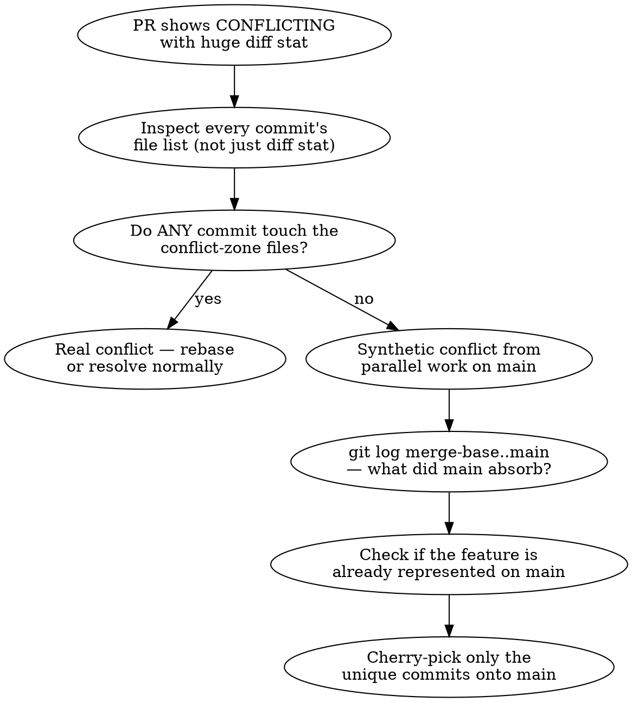

## Symptom

PR #349 (`chain-drop-candidates`) was OPEN with `mergeable: CONFLICTING`. A first pass at the diff was alarming:

```
$ git diff main..origin/chain-drop-candidates --stat
 client/src/features/admin/pages/Admin.tsx          |  580 +++----
 .../commissioner/__tests__/Commissioner.test.tsx   |  220 ++-
 client/src/features/commissioner/commissioner.css  |   99 --
 .../components/CommissionerRosterTool.tsx          |  960 ++++-------
 .../features/commissioner/pages/Commissioner.tsx   | 1807 +++++++++-----------
 ...
 29 files changed, 2797 insertions(+), 2470 deletions(-)
```

The natural read: this branch is far from main, and resolving the conflict is going to be huge. The implication is "rebase or abandon."

## Investigation

The branch only had 5 commits. Inspecting each commit's file list told a different story:

```
$ for sha in aca1634 b1ccf14 c5f4d2d df3c54e 452189c; do
    git show --stat --format="%s" $sha | head -5
  done
```

Each commit only touched:

- `AddDropPanel.tsx` (the feature)
- `AddDropPanel.test.tsx`
- A small set of new files: server slotMatcher tests, MCP transactionTools, docs/solutions/, todos/

**Zero commits modified** `Admin.tsx`, `Commissioner.tsx`, `CommissionerRosterTool.tsx`, `Home.tsx`, or the `cm-*` CSS.

So where were those 2,797 inserted/2,470 deleted lines coming from?

```
$ git merge-base main origin/chain-drop-candidates
43eb6afa77cf...

$ git log --oneline 43eb6afa...main
deeef46 feat(commissioner): full cm-* visual redesign with Score Sheet design system (#351)
063162c feat(commissioner,admin): redesign hub pages with job-shaped IA (#350)
```

Two big PRs landed on main **after** `chain-drop-candidates` branched off. Those PRs rewrote the same files the feature branch sat next to but didn't modify. The "diff" was reading the feature branch as *removing* those changes, because they didn't exist when the branch was cut.

## Root cause

`git diff main..feature` is symmetric. It cannot distinguish between:

1. The feature branch **deleted** code that exists on main, vs
2. The feature branch **predates** code that was added on main

The merge-base and the topology distinguish them, but the stat output does not. A long-lived feature branch sitting through a large refactor on main looks identical, at the stat level, to a branch that aggressively removed unrelated code.

Compounding factor: it's worse when the refactored area is *adjacent* to the feature. PR #350's hub redesign rewrote `Commissioner.tsx` and `CommissionerRosterTool.tsx` — which are siblings of the `AddDropPanel.tsx` the chain-drop feature actually touched. Pattern-matching on file proximity makes the synthetic conflict feel real.

There was also a secondary trap: **two of the feature's five commits had already been absorbed into main** through PR #350. The first commit (1-hop chain) and the third commit (BFS upgrade) were both implemented in PR #350 as part of the broader redesign. Only the three review-fix commits added net new value vs current main.

## Solution

The diagnostic flow:



Applied here:

```
$ git checkout -b chain-drop-rebased origin/main
$ git cherry-pick c5f4d2d b1ccf14 aca1634   # the 3 review-fix commits
# zero conflicts — they touch AddDropPanel.tsx + new files only,
# and PR #350's BFS implementation accepts the refinements
```

Result: 102 tests pass (56 client + 40 server + 6 MCP). Single clean PR (#354) replaces the 5-commit conflicting #349.

## Prevention

**Don't trust `gh pr view`'s CONFLICTING flag alone — inspect the commit topology.** The mergeability flag and the diff stat both lie about long-lived branches. The truth lives in `git log --stat $merge_base..feature` (what the feature actually did) and `git log $merge_base..main` (what main absorbed).

**For long-lived feature branches:**

1. **Re-baseline weekly** when main has active refactors landing. A merge or rebase against main each Monday keeps the conflict surface honest. Skipping for a month means a real conflict and a synthetic conflict become indistinguishable in the tooling.
2. **Watch for "your feature already shipped" overlap.** Adjacent design refactors sometimes implement the same feature in the new design. Before rebasing, diff main against the feature branch *for the feature files only* — if main already has equivalent logic, the rebase is partial absorption, not a full replay.
3. **Cherry-pick is often cleaner than rebase** when only some commits are still relevant. `git rebase` insists on replaying every commit; `cherry-pick` lets you skip ones that are obsolete (already in main, refactored away, etc).

**Diagnostic command to add to muscle memory:**

```bash
# What's the actual blast radius of this branch?
$ git log --stat $(git merge-base main HEAD)..HEAD | grep -E '^ [a-z]'
```

Compare to `git diff main --stat` — if the former is much smaller, the diff stat is misleading and the "conflict" is largely synthetic.

## Variant: squash-merged sibling PR (2026-07-06)

A second trigger for the *same* "the tool says conflict, the topology says clean" phenomenon — but with **disjoint files and a small diff**, so the parallel-refactor tell (huge diff stat) is absent.

### Symptom

Two independent PRs (`#414` IL cache fix, `#415` email signup) branched off the same base and touched **completely disjoint files**. `#415` was **squash-merged** to main first. Then `#414` would not merge:

```
$ gh pr merge 414 --squash --delete-branch
GraphQL: Pull Request is not mergeable (mergePullRequest)

$ gh pr view 414 --json mergeable,mergeStateStatus   # persisted across retries
UNKNOWN / UNKNOWN

$ gh pr update-branch 414
X Cannot update PR branch due to conflicts
```

### Root cause

A **squash-merge collapses the merged PR's commits into one brand-new commit** on main that shares no commit identity with what the sibling branch was based on. GitHub's *asynchronous* mergeability computation can get stuck on `UNKNOWN` or emit a **false CONFLICTING** after the base moves this way — even though git's own 3-way merge is clean because the files never overlapped. `update-branch` (which merges base→head server-side) inherits the same false conflict.

### The disambiguating test

Ask **git**, not GitHub:

```
$ git fetch origin fix/il-status-cache-freshness
$ git merge --no-commit --no-ff origin/fix/il-status-cache-freshness
Automatic merge went well; stopped before committing as requested   # ← CLEAN
$ git merge --abort
```

Clean local merge + disjoint file lists (`git diff --name-only main...origin/<branch>`) ⇒ the GitHub conflict is synthetic.

### Resolution (works because `main` is not branch-protected here)

Merge locally and push; the PR auto-closes when GitHub sees its diff on main is empty, or close it with a note:

```
$ git checkout main && git pull
$ git merge --squash origin/fix/il-status-cache-freshness
$ git commit -m "fix(il): ... (#414)"
$ git push origin main
$ gh pr close 414 --comment "Merged via squash <sha>; GitHub showed a synthetic conflict from #415's squash topology."
```

(If main *were* protected, the equivalent is `git rebase origin/main` on the branch + force-push, which forces GitHub to recompute mergeability against real content.)

### How this variant differs from the parallel-refactor one above

| | Parallel refactor (2026-06-01) | Squash-merged sibling (2026-07-06) |
|---|---|---|
| Diff stat | **Huge** (adjacent files rewritten on main) | **Small / disjoint** |
| GitHub flag | `CONFLICTING` | `UNKNOWN` → "not mergeable" |
| Real overlap | Adjacent files, some feature already absorbed | **None** — fully disjoint |
| Fix | Cherry-pick unique commits onto main | Local squash-merge + push (or rebase to force recompute) |

Same lesson both times: **the mergeability flag is advisory; the merge-base + a local `git merge --no-commit` are authoritative.** See memory [synthetic merge conflicts](../../../memory/feedback_synthetic_merge_conflicts.md) and [stacked PR squash-merge](../../../memory/feedback_stacked_pr_squash_merge.md).

## See also

- PR #349 (closed) → PR #354 (the rebased replacement)
- PR #350 (commissioner+admin hub redesign with job-shaped IA)
- PR #351 (cm-* visual redesign with Score Sheet design system)
- Memory: [stacked PR squash-merge](../../../memory/feedback_stacked_pr_squash_merge.md) — related family of "the tool says one thing, the topology says another"
